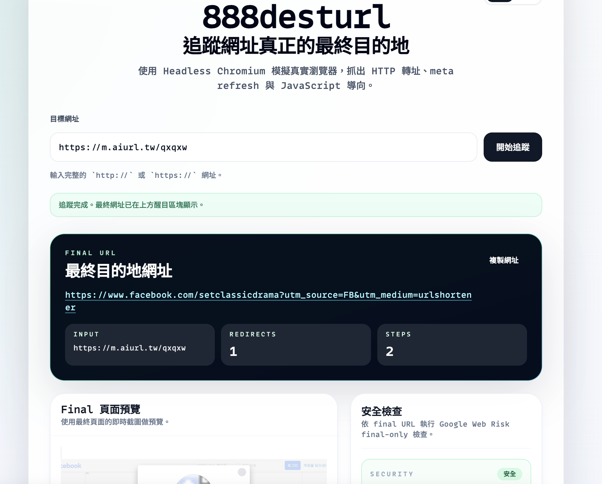
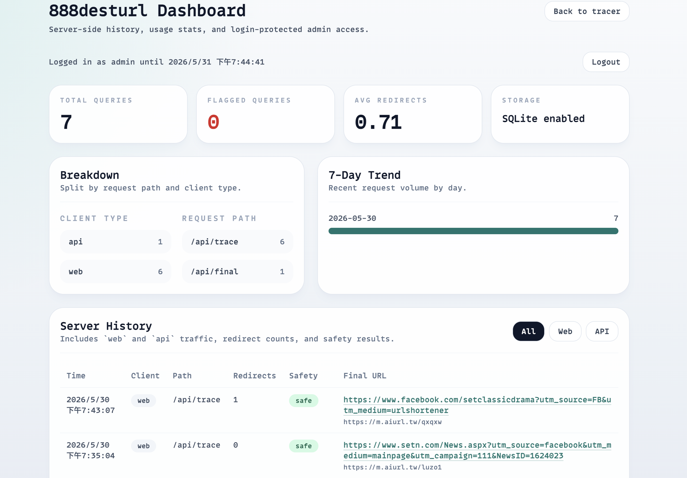
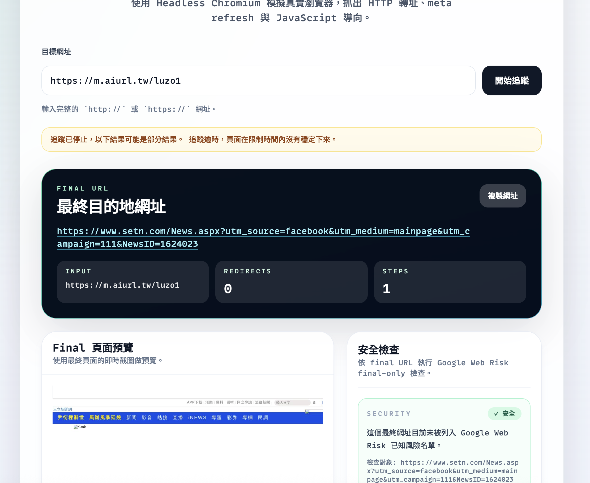

# 888desturl

`888desturl` 是一個用來追蹤網址最終目的地的工具，基於 Node.js、Fastify 與 Playwright（Headless Chromium）建構。它不只追蹤傳統 HTTP 3xx，還能處理 `meta refresh` 與 JavaScript 導向，現在也支援：

- 靜態轉址網址自動解包 (YouTube, Facebook, Google, Slack) 以加速追蹤並避免機器人阻擋
- YouTube 中介警告頁面（"Are you sure you want to leave YouTube?"）自動點擊繞過機制
- final-only Google Web Risk 檢查
- final 頁面截圖預覽
- 每次 trace 的獨立結果頁
- 可分享的結果頁 metadata 與結果頁連結複製
- 追蹤參數分析與可分享的乾淨網址（保留原始最終網址）
- 7 天預覽圖保留與自動清理
- browser localStorage 最近查詢紀錄
- SQLite server history / usage stats
- admin login 與 admin dashboard
- 可安裝的 PWA（Web App Manifest、桌面／行動裝置圖示、Service Worker）
- 首頁 App Shell 離線快取與離線提示頁




Live site:

- `https://url.david888.com`


## Stack

- Backend: Node.js, Fastify, Playwright
- Storage: SQLite
- Frontend: HTML, Vanilla JavaScript, Tailwind CSS via CDN
- Deployment: Docker, Docker Compose

## First-Time Setup

### 1. Prepare env

複製 `.env.example` 成 `.env`，再填入你的設定值：

```bash
cp .env.example .env
```

必要欄位：

- `GOOGLE_WEB_RISK_API_KEY`
- `ADMIN_USERNAME`
- `ADMIN_PASSWORD`

建議欄位：

- `DATA_DIR=./data`
- `PREVIEW_RETENTION_DAYS=7`
- `HISTORY_RETENTION_DAYS=90`

### 2. Install dependencies

```bash
npm install
```

這一步會安裝 `playwright` 與 `sqlite3`。

### 3. Install Playwright Chromium locally if needed

```bash
npx playwright install chromium
```

### 4. Start the app

```bash
npm start
```

Open `http://localhost:3000`.

## PWA

在支援 PWA 的瀏覽器中開啟 HTTPS 正式站後，可透過首頁的「安裝 App」按鈕或瀏覽器選單安裝。`localhost` 開發環境也可測試安裝流程。

離線行為：

- 首頁、manifest、App 圖示與離線提示頁會預先快取
- 曾載入的靜態資源可由 runtime cache 提供
- `/api/*`、`/admin`、`/previews/*` 與健康檢查不會寫入 PWA cache
- 網址追蹤本身仍需連線；離線時會顯示專用提示頁

修改 `public/service-worker.js` 的 App Shell 後，請同步調整 `CACHE_VERSION`，讓既有安裝更新快取。

## Docker

Build and run:

```bash
docker compose up -d --build
```

Stop:

```bash
docker compose down
```

Current `docker-compose.yml` behavior:

- loads variables from `.env`
- mounts `./data` to `/app/data`
- keeps preview images and SQLite data outside the container layer

## Environment Variables

Example:

```dotenv
PORT=3000
HOST=0.0.0.0
DATA_DIR=./data
PREVIEW_RETENTION_DAYS=7
HISTORY_RETENTION_DAYS=90
GOOGLE_WEB_RISK_API_KEY=replace-with-your-key
ADMIN_USERNAME=admin
ADMIN_PASSWORD=change-this-password
ADMIN_SESSION_TTL_HOURS=24
```

Notes:

- `.env` is ignored by git
- `.env` is excluded from Docker build context
- preview images are stored under `DATA_DIR/previews`
- SQLite database is stored under `DATA_DIR/history.sqlite`

## API

### `GET /api/trace`

Full redirect diagnostics plus final-only security check and final-image preview URL.

Query:

- `url`: required full `http://` or `https://` URL
- `context`: optional, supports `line`

Response highlights:

```json
{
  "final_url": "https://example.com/final",
  "clean_url": "https://example.com/final",
  "removed_tracking_parameters": ["utm_source"],
  "input_url": "https://example.com/start",
  "result_id": "AbCdEf123456",
  "result_url": "https://url.david888.com/result/AbCdEf123456",
  "redirect_count": 2,
  "preview_url": "/previews/2026/05/30/abcd1234.jpg",
  "final_image_url": "/previews/2026/05/30/abcd1234.jpg",
  "security": {
    "status": "safe",
    "source": "google_webrisk",
    "checked_url": "https://example.com/final",
    "checked_at": "2026-05-30T08:00:00.000Z",
    "message": "No Google Web Risk match was found for the final destination.",
    "threat_types": []
  },
  "chain": []
}
```

If the browser UI calls this endpoint, it sets header `x-888desturl-client: web`. Other callers are stored as `api` traffic in server history by default.

### Final URL tracking-parameter analysis

Every JSON trace result provides both the literal final destination and an optional copy-friendly version:

- `final_url`: the exact final URL observed by Playwright. It remains the trace record and the URL used for Google Web Risk checks.
- `clean_url`: the same URL with only recognised tracking parameters removed. It is `null` when no final URL is available.
- `removed_tracking_parameters`: names of parameters removed from `clean_url`; values are intentionally not returned. It is an empty array when nothing was removed.

The cleaner is deliberately conservative. It removes common identifiers such as `utm_*`, `fbclid`, `gclid`, `dclid`, `msclkid`, `_ga`, `_gl`, `igshid`, `mibextid`, `mc_cid`, and `mc_eid`. For `threads.com` it also removes `xmt` and `slof`. Other parameters, including `id`, `token`, `state`, and `ref`, are preserved because they can affect destination behaviour.

When tracking parameters were removed, the web UI presents `clean_url` as the single recommended share action. The original final URL remains visible and can still be opened for diagnostics.

### `GET /api/final`

Final destination only.

Query:

- `url`: required full `http://` or `https://` URL
- `format`: optional, default `text`, supports `json`
- `context`: optional, supports `line`

`format=json` also includes:

- `result_id`
- `result_url`
- `clean_url`
- `removed_tracking_parameters`
- `preview_url`
- `final_image_url`
- `security`

The default `text` response remains the literal `final_url` for CLI compatibility.

### `GET /api/f`

Short CLI alias for `/api/final`.

### `GET /ai-agent-skill`

Returns a Markdown skill document for the current deployment host. It documents the trace endpoints and instructs agents to present `clean_url` as the copy-friendly URL whenever `removed_tracking_parameters` is non-empty.

### `GET /api/results/:resultId`

Public result lookup for one previously recorded trace result.

Use this when:

- you want to render a standalone result page
- you want to revisit one trace later
- you want a shareable detail URL without re-running the trace

Response includes:

- `result_id`
- `result_url`
- `created_at`
- `input_url`
- `final_url`
- `clean_url` and `removed_tracking_parameters` (the copy-friendly URL analysis; the literal final URL is preserved)
- `preview_url`
- `final_image_url`
- `security`
- `security_status`
- `chain`

Compatibility note:

- `security_status`, `security_message`, `security_checked_url`, and `threat_types` are still returned for existing clients
- new clients should prefer the nested `security` object

### `GET /api/results/:resultId/final-image`

Public final-image lookup for one stored trace result.

Response includes:

- `result_id`
- `available`
- `status`
- `final_image_url`
- `image_url`
- `mime_type`

If the trace result still exists but the preview image has already expired, this endpoint returns `available: false` and `status: "unavailable"`.

### `GET /api/results/:resultId/web-risk`

Public Web Risk lookup result for one stored trace result.

Response includes:

- `result_id`
- `security`

### `GET /health`

Health check:

```json
{
  "ok": true,
  "storage_enabled": true,
  "web_risk_enabled": true
}
```

## Admin

Admin page:

- `GET /admin`

Admin APIs:

- `GET /api/admin/session`
- `POST /api/admin/login`
- `POST /api/admin/logout`
- `GET /api/admin/stats`
- `GET /api/admin/history`

Security behavior:

- login is controlled by `ADMIN_USERNAME` and `ADMIN_PASSWORD`
- login attempts are limited to 3 per 5 minutes per IP
- authenticated admin access uses an HttpOnly cookie session

Current limitation:

- admin sessions are stored in memory
- restarting the service logs out admin users
- multi-instance deployments would need shared session storage later

## Result Pages

Every stored trace result now gets a stable `result_id`.

Public result URLs:

- `GET /result/:resultId`
- `GET /r/:resultId`

Behavior:

- the page reads data from `GET /api/results/:resultId`
- the result page includes shareable metadata for social previews
- the result page can copy its own standalone URL
- admin history links directly to the standalone result page
- preview images may disappear after the preview retention window
- the result row itself remains available until history retention removes it
- if the history record expires, the result page returns not found

## Retention

- preview screenshots: 7 days by default
- server history: 90 days by default
- cleanup runs at startup and every 12 hours

When a preview expires:

- the image file is deleted
- the history row remains, but `preview_url` is cleared

## Main Files

```text
├── .env.example
├── CHANGELOG.md
├── Dockerfile
├── docker-compose.yml
├── lib/
│   ├── admin-auth.js
│   ├── env.js
│   └── storage.js
├── package.json
├── public/
│   ├── admin.html
│   ├── index.html
│   └── result.html
└── server.js
```
